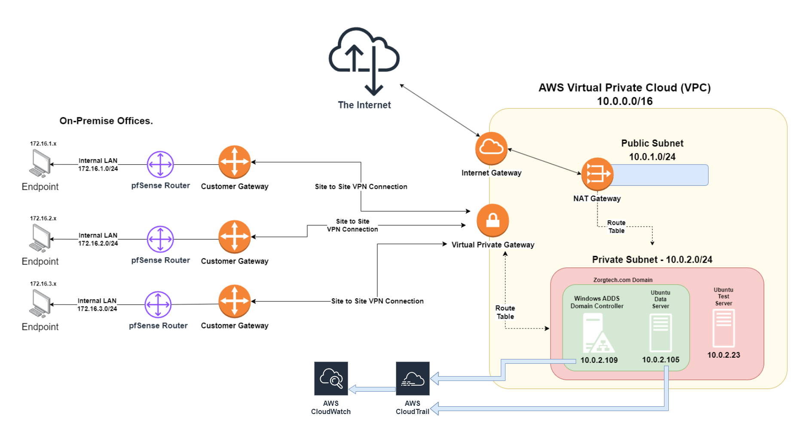

# Network Architecture

## Network Topology

## Amazon Web Services Infrastructure

For security, no public facing IP addresses will be shown in this document.

| **AWS Components**                          | **Description**                                                                                                                                                                                                                                                                                                                                                                                                                                                                                                                                                                                                                                                                                                                                                                                                                                                                                                                                                                                                                                                                                                                                                                                                                                                                       |
| :------------------------------------------ | :------------------------------------------------------------------------------------------------------------------------------------------------------------------------------------------------------------------------------------------------------------------------------------------------------------------------------------------------------------------------------------------------------------------------------------------------------------------------------------------------------------------------------------------------------------------------------------------------------------------------------------------------------------------------------------------------------------------------------------------------------------------------------------------------------------------------------------------------------------------------------------------------------------------------------------------------------------------------------------------------------------------------------------------------------------------------------------------------------------------------------------------------------------------------------------------------------------------------------------------------------------------------------------ |
| Virtual Private Cloud (VPC) - `10.0.0.0/16` | On AWS, we created a Virtual Private Cloud (VPC) with the network CIDR of `10.0.0.0/16` to allow us to create multiple subnets, which we separated into a public and private subnets as needed.                                                                                                                                                                                                                                                                                                                                                                                                                                                                                                                                                                                                                                                                                                                                                                                                                                                                                                                                                                                                                                                                                       |
| Internet Gateway (IGW)                      | Next is an Internet Gateway, which we will assign to our VPC. This will allow us to route outbound internet traffic so out instances, even those hosted on private subnets, can open connections to the internet for new packages, software updates, and critical security updates from upstream like Microsoft (Windows server) and Ubuntu (Linux data servers)                                                                                                                                                                                                                                                                                                                                                                                                                                                                                                                                                                                                                                                                                                                                                                                                                                                                                                                      |
| Customer Gateways (CGW)                     | Customer Gateways (CGW) are one half of the components that build the our Virtual Private Network (VPN) to AWS. CGW were individually deployed with each team member's public IP address (a CGW per IP) so to connect their pfSense routers, and subsequent internal local area networks (LANs), to the AWS infrastructure through an encrypted Virtual Private Network (VPN) tunnel individually created for each pfSense.                                                                                                                                                                                                                                                                                                                                                                                                                                                                                                                                                                                                                                                                                                                                                                                                                                                           |
| Virtual Private Gateway (VGW)               | This is the secondary compontent of a VPN tunnel, representing the point of connection to our VPC. All that is necessary here is to attach it to the VPC.                                                                                                                                                                                                                                                                                                                                                                                                                                                                                                                                                                                                                                                                                                                                                                                                                                                                                                                                                                                                                                                                                                                             |
| Virtual Private Network (VPN) Tunnel        | When creating a VPN Tunnel, we define the VGW and CGW being connected (setting the entry/exit points for the tunnel), and then establish the internal networks of those endpoints as well as a static route target (`172.16.x.y`) that will be propogated to the appropriate route tables. While we could allow all traffic from any external networks past the endpoints, we've limited it here to `10.0.0.0/16` (our VPC and its various subnets) and a `172.16.x.x/24` network specific to each CGW.   We accomplished this by setting up a pfSense router VM on Bridged mode and an internal network following a `172.16.x.y/24` convention. Each internal network for the various Customer Gateways were assigned a different `x` for their lan: one location has a `172.16.1.0/24` network and the next would have `172.16.2.0/24`. This was done to avoid any possible IP conflicts and for security logging purposes.   Should a malicious actor gain access to an internal network we can know from their IP address which network is compromised. Our routing table will then direct traffic from these VPN tunnels to our private subnet and _only_ the private subnet. VPNs are segmented from one another, preventing any laternal movement from bad actors. |
| Subnet 01 (Public) - `10.0.1.0/24`          | Our first subnet -- `10.0.1.0/24` is only utilized to house our NAT Gateway so our instances on the private subnet are capable of accessing the internet without having a public IP address.                                                                                                                                                                                                                                                                                                                                                                                                                                                                                                                                                                                                                                                                                                                                                                                                                                                                                                                                                                                                                                                                                          |
| Subnet 02 (Private) - `10.0.2.0/24`         | The `10.0.2.0/24` is our private subnet. All instances on this subnet will have no public IPs and associated routings tables and security groups will only accept inbound traffic from known networks. A NAT Gateway will be used on the Public Subnet to communicate with the Internet Gateway to allow these instances to have outbound internet access to download critical updates or necessary third party software.                                                                                                                                                                                                                                                                                                                                                                                                                                                                                                                                                                                                                                                                                                                                                                                                                                                             |
| NAT Gateway                                 | The Network Address Translation Gateway (NAT Gateway) is associated with the public subnet, which has access to the IGW, and given a public elastic IP address which will be the external IP address for all outbound internet traffic; similar to how a home network is represented by a single external IP address.                                                                                                                                                                                                                                                                                                                                                                                                                                                                                                                                                                                                                                                                                                                                                                                                                                                                                                                                                                 |

Connecting the parts of our architecture are a pair of routing tables, both associated with our VPC and the private and public subnets respectively.

### Public Subnet Routing Table

The route table below is associated with our Public Subnet `10.0.1.0/24`

| **Destination** | **Target**       | **Description**                                                              |
| :-------------- | :--------------- | :--------------------------------------------------------------------------- |
| `0.0.0.0/0`     | Internet Gateway | Allows the Internet Gateway to connect to any IP on the internet.            |
| `10.0.0.0/16`   | local            | Allows traffic in the public subnet to passthrough to any subnet on the VPC. |

### Private Subnet Routing Table

The route table below is associated with our Private Subnet `10.0.2.0/24`

| **Destination** | **Target**              | **Description**                                                                                                                                                                                                                     |
| :-------------- | :---------------------- | :---------------------------------------------------------------------------------------------------------------------------------------------------------------------------------------------------------------------------------- |
| `0.0.0.0/0`     | NAT Gateway             | Connects our private subnet to our NAT Gateway on the public subnet, which translates our private IPs to our associated public IP when we reach outside of our network.                                                             |
| `10.0.0.0/16`   | local                   | Allows traffic between instances on the VPC subnets. This is necessary for allowing our Linux Data Server to join the Windows ADDS domain, which allows us to manage access to the Linux data server through our domain controller. |
| `172.16.0.0/16` | Virtual Private Gateway | Ensures all traffic from our off-cloud networks (`172.16.x.y`) can route through our Virtual Private Gateway that is connected to our private subnet `10.0.2.0/24`                                                                  |

### Security Group Rules

The following table lists the security group we put in place to be used for instances on the private subnet (`10.0.2.0/24`)
| 

## Virtual Machines in the Cloud

| **EC2 Instances**   | **IP Address** |
| :------------------ | :------------: |
| Windows ADDS Server |   10.0.2.109   |
| Linux Data Server   |   10.0.2.105   |
| Linux Test Server   |   10.0.2.23    |

While we considered using our own server to back up the data server, since we are already using AWS EBS encryption for data at rest encryption, and a variety of AWS monitoring tools with S3 buckets, we decided to back up these volumes to a secure S3 bucket as well.

## Future Considerations

One possible implementation we discussed but, did not have the time to put in place, was setting up a fallback server for the data server. So that when the Data server is backed up, a fallback server would have its volume updated to match. Should the Data Server be taken down due to an attack, a lambda function would spin up the fallback to ensure continued availability of the data.

Documentation written by: Marcus Nogueira
